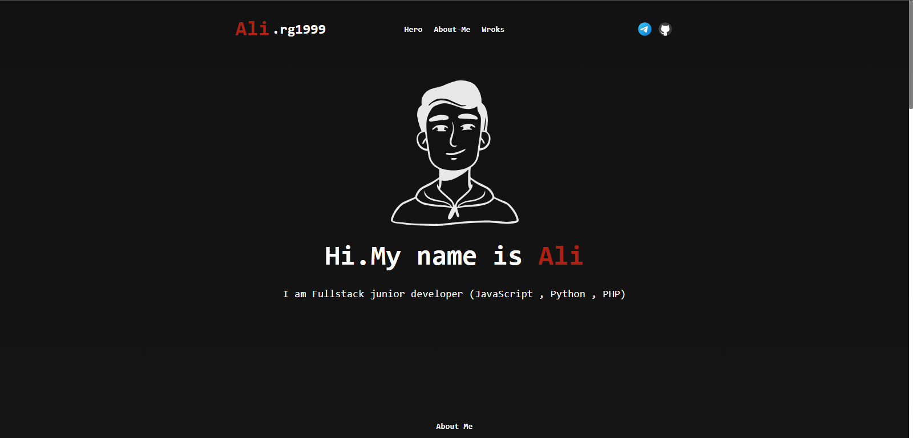

# Alirg1999 profile_CV

**Warning**: This is Personal website.

## Contents

- [Nextjs](https://react.dev/) The React Framework for the Web
- [Chakra-ui](https://chakra-ui.com/) Chakra UI is a simple, modular and accessible component library that gives you the building blocks you need to build your React applications.
- [Framer-Motion](https://www.framer.com/motion/) Framer Motion animation library for Reactjs

## Use Contents

```
yarn install
or
npm install
```

## Code Editor

- [NeoVim](https://neovim.io/)
- [My confing neovim](https://github.com/alirg-1999/config-neovim-me.git)
